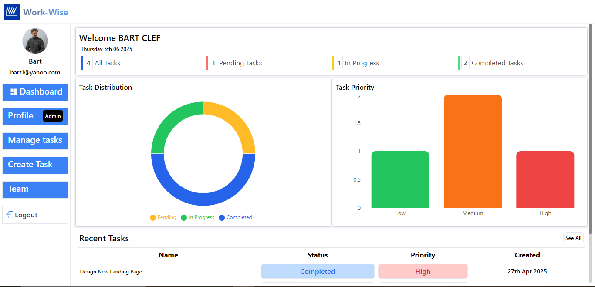
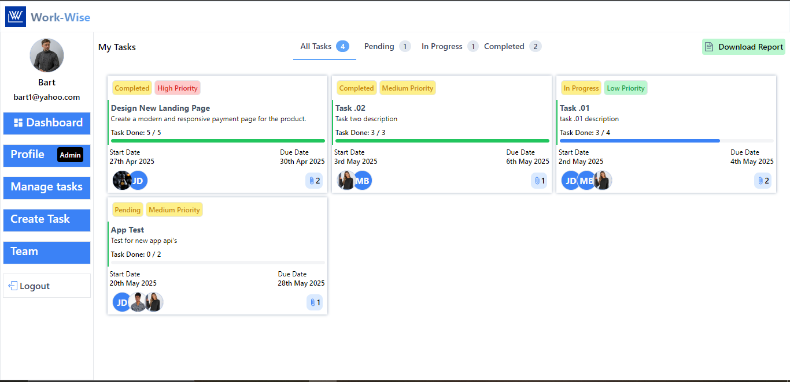
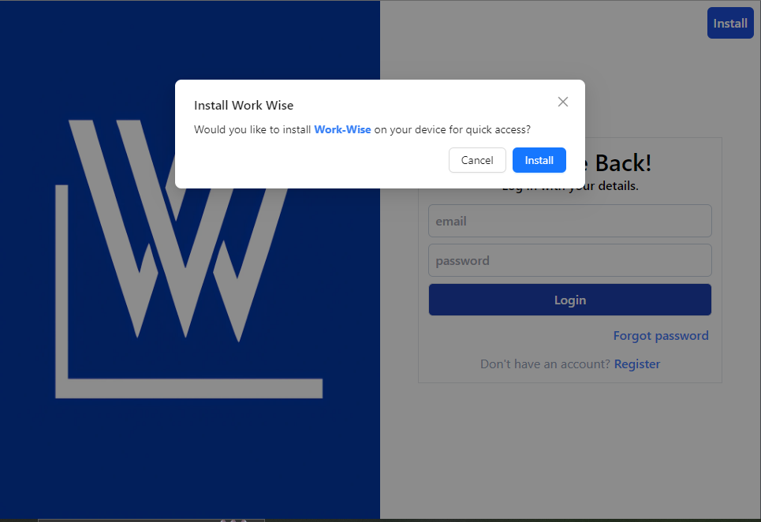

# WORK-WISE 🧠✅


WORK-WISE is a fullstack PERN (PostgreSQL, Express, React, Node.js) Progressive Web App (PWA) for efficient task and team management. It supports authentication, offline access, real-time UI updates, and background sync — giving it a native app experience.

---

## 🌐 Live Demo

🔗 [Visit Work-Wise on Render](https://work-wise-u6cm.onrender.com)

---

## 📦 Tech Stack

### Frontend
- **React 19**, **Vite**
- **Redux Toolkit** & **Redux Persist**
- **React Router DOM**
- **Ant Design (antd)** UI framework
- **Recharts**, **React Icons**, **React Toastify**
- **Workbox CLI** (for PWA support)
- **Helmet Async**, **Boxicons**, **Moment**

### Backend
- **Node.js**, **Express**
- **Supabase** (PostgreSQL + Authentication)
- **Cloudinary** (Image Uploads)
- **JWT**, **bcryptjs**, **validator**
- **Multer**, **ExcelJS**
- **Helmet**, **CORS**, **Morgan**
- **Nodemailer** (Password Reset Emails)

---

## 🔐 Features

- 🔐 **Secure Authentication** (Register, Login, Reset Password)
- 🧠 **Task Management** (CRUD tasks, assign to team members)
- 📶 **Offline Access** (PWA-ready with Workbox caching)
- 🕐 **Background Sync** support
- 📁 **Export to Excel**
- ☁️ **Cloudinary** image storage
- 🔐 **Protected routes** via JWT
- 📧 **Password reset** via email (Nodemailer)

---

## 📷 Screenshots

### Homepage


### Login Page


### Dashboard


### Tasks Page


### Offline mode / PWA install prompt


---

## 📁 Folder Structure

```
WORKWISE/
├── client/
│   ├── src/
│   ├── public/
|   ├── index.html
|   ├── vite.config.js
│   └── workbox.config
├── server/
│   ├── Controller/
│   ├── Routes/
│   ├── Utilz/
│   ├── db.js
|   └── index.js
└── README.md
```


---

## ⚙️ Installation & Setup

1. **Clone the repository:**
   ```bash
    git clone https://github.com/your-username/work-wise.git
    cd work-wise
   ```


## 🛠️ Build & Deploy (Render)

    Ensure vite.config.js points to correct base path (if any).

    Set your Render build commands:

        client: npm run build (from Vite)

        server: npm start

    Configure environment variables in Render dashboard.

## 📦 PWA Setup Notes

    Uses workbox-cli to generate serviceWorker.js in dist/

    Automatically caches assets like *.html, *.js, *.css, *.png

    Runtime caching:

        StaleWhileRevalidate for CSS

        CacheFirst for images

        NetworkFirst for API calls to https://work-wise-u6cm.onrender.com/api/

## Contact
If you have any questions, feedback, or would like to connect, feel free to reach out to me.

Name: Chibuzor Henry Amaechi
Email: amaechihenrychibuzor@gmail.com
Feel free to contact me through any of the channels above. I'm open to collaborations and discussions related to Flutter development or any other projects.

